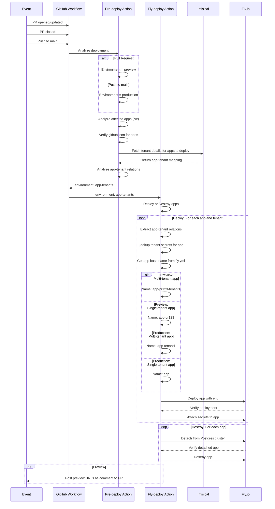

# Deployment Guide <!-- omit in toc -->

This document explains the deployment architecture and configuration for the Codeware monorepo, which uses GitHub Actions to automatically deploy applications to Fly.io with support for multi-tenant deployments.

## Table of Contents <!-- omit in toc -->

- [Overview](#overview)
- [Architecture](#architecture)
- [Configuration](#configuration)
  - [Per-App Configuration (github.json)](#per-app-configuration-githubjson)
  - [Fly Configuration Files](#fly-configuration-files)
  - [Tenant Configuration (Infisical)](#tenant-configuration-infisical)
  - [Secret Loading: Deployment vs Runtime](#secret-loading-deployment-vs-runtime)
  - [Deployment Rules (Required)](#deployment-rules-required)
  - [GitHub Secrets](#github-secrets)
- [Deployment Flow](#deployment-flow)
  - [Multi-Tenant Deployment](#multi-tenant-deployment)
  - [Single-Tenant Apps](#single-tenant-apps)
- [How to Add a New App](#how-to-add-a-new-app)
- [How to Add/Remove Tenants](#how-to-addremove-tenants)
  - [Add a New Tenant](#add-a-new-tenant)
  - [Remove a Tenant](#remove-a-tenant)

## Overview

The deployment system automatically:

- Determines deployment environment (preview for PRs, production for main)
- Analyzes which Nx apps have been affected by code changes
- Fetches tenant configuration from Infisical for multi-tenant apps
- Deploys each app to Fly.io (once per tenant for multi-tenant apps)
- Posts preview URLs as PR comments

## Architecture

### Components <!-- omit in toc -->

```text
┌──────────────────────────────────────┐
│ GitHub Actions Workflow              │
│                                      │
│ .github/workflows/fly-deployment.yml │
└──────────────────────────────────────┘
    │
    ├─► Job 1: pre-deploy
    │    ├─ Determine environment (preview/production)
    │    ├─ Analyze affected Nx apps
    │    ├─ Fetch secrets and app-tenant relationships
    │    │   from Infisical
    │    └─ Output: apps, environment, app-tenants
    │
    └─► Job 2: fly-deployment
         ├─ For each app to deploy:
         │   ├─ If multi-tenant: deploy once per tenant
         │   └─ If single-tenant: deploy once
         └─ Post preview comment (for PRs)
```

### Key Packages <!-- omit in toc -->

1. **[@cdwr/nx-pre-deploy-action](packages/nx-pre-deploy-action/README.md)** - Analyzes deployment requirements
   - Determines target environment based on GitHub event
   - Identifies affected Nx applications
   - Validates `github.json` for each application
   - Fetches app-specific tenant configuration and secrets from Infisical
2. **[@cdwr/nx-fly-deployment-action](packages/nx-fly-deployment-action/README.md)** - Executes deployments
   - Manages Fly.io application lifecycle
   - Handles multi-tenant deployments
   - Manages preview/production environments

> [!NOTE]
> See individual package READMEs for detailed API documentation, configuration options, and usage examples.

## Configuration

### Per-App Configuration (github.json)

Each deployable app needs a `github.json` file in its root directory (same location as `fly.toml`):

```json
{
  "$schema": "../../libs/shared/util/schemas/src/lib/github-config.schema.json",
  "flyPostgresPreview": "${POSTGRES_PREVIEW}",
  "flyPostgresProduction": "my-production-db"
}
```

**Fields:**

- `flyPostgresPreview` (string, optional) - Fly Postgres cluster name for preview env
- `flyPostgresProduction` (string, optional) - Fly Postgres cluster name for production env

**Deployment Detection:**

Apps are automatically detected for deployment if they have:

1. A `github.json` file in the app root
2. A Fly configuration file (see [Fly Configuration Files](#fly-configuration-files))

**Examples:**

Multi-tenant app (web):

```json
{}
```

Empty `github.json` is valid - the app will be deployed if it has a `fly.toml` file.

Single-tenant app (cms):

Using a Fly Postgres cluster for preview (pull request) apps. Production database is not hosted by Fly.

```json
{
  "flyPostgresPreview": "${POSTGRES_PREVIEW}"
}
```

### Fly Configuration Files

Apps need a Fly configuration file to be deployed. The system looks for config files in this priority order:

1. **Environment-specific config**: `fly.{environment}.toml` (e.g., `fly.production.toml`, `fly.preview.toml`)
2. **Default config**: `fly.toml`

This allows you to have different Fly configurations per environment while falling back to a shared config when environment-specific files don't exist.

> [!IMPORTANT]
> Fly configuration files are only used for deployment of **new apps**. For existing apps the remote configurations are preserved.
>
> This is to prevent overriding any individual ad-hoc configurations applied to the apps.

**Example: Different machine sizes per environment**

```toml
# fly.preview.toml - Smaller machines for preview
app = "my-app"

[[vm]]
  size = 'shared-cpu-1x'
  memory = '512mb'
```

```toml
# fly.production.toml - Larger machines for production
app = "my-app"

[[vm]]
  size = 'shared-cpu-2x'
  memory = '2gb'
```

### Tenant Configuration (Infisical)

Infisical is the single source of truth for both secrets and tenant configuration.

**Key Concepts:**

- App-level secrets: `/apps/<app-name>/*`
- Tenant-app secrets: `/tenants/<tenant-id>/apps/<app-name>/*`
- Tenant discovery: System scans `/tenants/` folder structure to determine which tenants use which apps
- Dynamic CORS: CMS automatically fetches tenant app URLs tagged with `cors` at boot for CORS configuration

> [!NOTE] Detailed multi-tenant setup
>
> - Complete folder structure guide
> - Secret classification (env vars vs encrypted secrets)
> - Step-by-step configuration examples
> - Deploy rules configuration
>
> **See:** [Multi-tenant Setup Guide](packages/nx-pre-deploy-action/README.md#multi-tenant-setup)

**Quick Example:**

```yml
# App-wide configuration
/apps/web/API_URL = "https://api.example.com"

# Per-tenant configuration
/tenants/demo/apps/web/PUBLIC_URL = "https://demo.example.com"
/tenants/acme/apps/web/PUBLIC_URL = "https://acme.example.com"
```

### Secret Loading: Deployment vs Runtime

Secrets are loaded at two distinct stages, each serving different purposes:

**Deployment-Time Secrets** (loaded during GitHub Actions)

- **Location**: `/tenants/<tenant-id>/apps/<app-name>/`
- **Purpose**: Configuration that determines how apps are deployed
- **Fetched by**: Pre-deploy action during CI/CD workflow
- **Examples**: `PUBLIC_URL`, `CMS_URL`, tenant-specific build configuration
- **Characteristics**:
  - Baked into Fly.io app configuration as env vars or secrets
  - Static after deployment (requires redeployment to change)
  - Uses metadata `env: true` to distinguish env vars from secrets (default)
- **Use when**: Configuration defines the deployment itself

**Runtime Secrets** (loaded when app starts)

- **Location**: `/apps/<app-name>/` and `/tenants/<tenant-id>/`
- **Purpose**: Sensitive data and operational secrets
- **Fetched by**: Application itself at startup using `withInfisical()` SDK
- **Examples**: Database credentials, API keys, encryption keys, feature flags
- **Characteristics**:
  - Loaded fresh on each app startup
  - Can be rotated without redeployment (app restart required)
  - Requires Infisical credentials set as Fly.io secrets
- **Use when**: Secrets need frequent rotation or shouldn't be in env vars

**Key Limitation**: Deployment-time secrets are static until next deployment. Runtime secrets add startup latency but enable rotation without redeployment.

**Public or hidden secret:**

Secrets can be resolved to either an environment variable or a hidden secret in Fly. Environment variables are visible and added to the Docker image at build-time and secrets are loaded at boot-time, fully encrypted.

Secrets in Infisical are handled as **secrets by default**.

To make a secret visible as **environment variable**, add metadata key `env` set to `true`.

### Deployment Rules (Required)

Control which apps and tenants are deployed per environment using a `DEPLOY_RULES` secret in the Infisical root path (`/`). **This secret is required** - deployments will fail if it's missing or misconfigured.

**Quick Setup:**

Create a `DEPLOY_RULES` secret with metadata or JSON value per environment:

```yml
Path: /
Secret: DEPLOY_RULES
Metadata per environment:
  preview:
    apps: '*'
    tenants: 'demo' # Only demo tenant in preview
  production:
    apps: '*'
    tenants: '*' # All tenants in production
```

**Rules format:** `apps: "*"` (all apps) or `apps: "web,cms"` (specific apps) | `tenants: "*"` (all) or `tenants: "demo,acme"` (specific)

> [!NOTE] Complete deployment rules documentation
>
> - Both configuration options (metadata vs JSON value)
> - Full rules format reference
> - Validation requirements
> - Advanced use cases
>
> **See:** [Deploy Rules Documentation](packages/nx-pre-deploy-action/README.md#3-deploy-rules)

### GitHub Secrets

Required secrets in GitHub repository settings:

```yml
INFISICAL_READ_CLIENT_ID       # Infisical auth client ID
INFISICAL_READ_CLIENT_SECRET   # Infisical auth client secret
INFISICAL_PROJECT_ID           # Infisical project ID
FLY_API_TOKEN                  # Fly.io API token
CDWR_ACTIONS_BOT_ID            # GitHub App ID for bot
CDWR_ACTIONS_BOT_PRIVATE_KEY   # GitHub App private key
```

Required variables:

```yml
INFISICAL_SITE                 # Infisical site region
FLY_ORG                        # Fly.io organization
FLY_REGION                     # Fly.io default region
FLY_OPT_OUT_DEPOT              # Opt out of depot builder
FLY_POSTGRES_PREVIEW           # Preview postgres cluster
```

## Deployment Flow



### Multi-Tenant Deployment

#### How It Works <!-- omit in toc -->

1. **Tenant-App Relations**: Pre-deploy action fetches tenant configuration from Infisical
2. **Per-Tenant Deployment**: Each tenant gets its own isolated Fly.io app instance
3. **Naming Convention**: The base app name from `fly.toml` (`app = "base-name"`) is used with suffixes:
   - Production: `<base-name>-<tenant-id>`
   - Preview: `<base-name>-pr<number>-<tenant-id>`
4. **Environment Variables**: Each instance receives `TENANT_ID`, `DEPLOY_ENV`, `APP_NAME`, and `PR_NUMBER`

> [!NOTE]
>
> - Detailed deployment mechanics
> - Naming conventions
> - app-details structure
>
> **See:** [Nx Fly Deployment Action - app-details input](packages/nx-fly-deployment-action/README.md#app-details)

#### Benefits <!-- omit in toc -->

✅ **Complete Isolation**: Each tenant has its own app instance  
✅ **Independent Scaling**: Scale tenants independently  
✅ **Tenant-Specific Configuration**: Each tenant can have its own secrets/config  
✅ **Easy Rollback**: Roll back one tenant without affecting others  
✅ **Clear Monitoring**: Per-tenant metrics and logs

### Single-Tenant Apps

- Deploy once per environment
- No tenant suffix in app name
- Traditional deployment model
- Example: `cms` app serves all tenants from single instance

## How to Add a New App

1. **Create github.json** in the app root:

   ```json
   {}
   ```

   Or with Postgres configuration:

   ```json
   {
     "flyPostgresPreview": "${POSTGRES_PREVIEW}",
     "flyPostgresProduction": "my-production-db"
   }
   ```

2. **Create fly.toml** in the app root:

   ```toml
   app = "my-new-app"
   primary_region = "arn"

   [build]
     dockerfile = "Dockerfile"

   [http_service]
     internal_port = 3000
     force_https = true
     auto_stop_machines = 'suspend'
     auto_start_machines = true
     min_machines_running = 0
     processes = ['app']

   [[vm]]
     size = 'shared-cpu-1x'
     memory = '1gb'
   ```

   Optionally create environment-specific configs:
   - `fly.preview.toml` - For preview deployments
   - `fly.production.toml` - For production deployments

3. **Configure Infisical**:
   - Create a folder and secrets at `/apps/my-new-app/*`
   - For multi-tenant apps: Create folders for related tenants `/tenants/<id>/apps/my-new-app/`

4. **Push changes** - deployment happens automatically!

## How to Add/Remove Tenants

### Add a New Tenant

1. **Create folder structure** in Infisical for each app the tenant will use:

   ```yml
   /tenants/<new-tenant-id>/apps/<app>
   ```

2. **Add tenant-specific secrets** when needed:

   ```yml
   /tenants/<new-tenant-id>/apps/web/API_KEY = "..."
   /tenants/<new-tenant-id>/apps/web/CUSTOM_CONFIG = "..."
   ```

3. **Deploy** - next deployment will automatically detect and deploy the new tenant!

### Remove a Tenant

1. **Delete folder** in Infisical:
   - Remove `/tenants/<tenant-id>/` folder entirely

2. **Clean up Fly.io apps** (manual):

   ```bash
   fly apps destroy web-<tenant-id> --yes
   fly apps destroy web-pr123-<tenant-id> --yes  # if preview exists
   ```

3. **Next deployment** will no longer include this tenant
