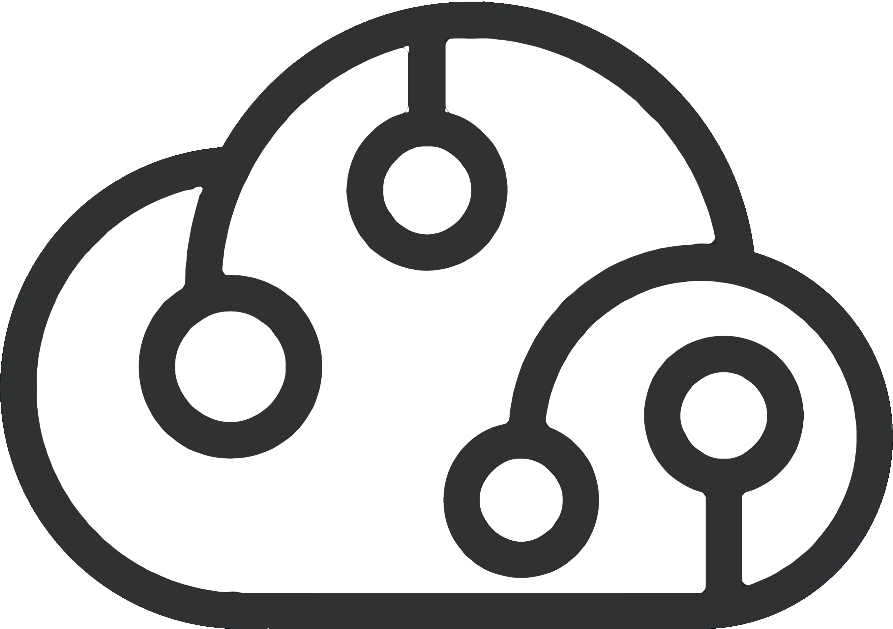

<p align="center">
  <br />
  
  <br />
  <br />
</p>

<h1 align='center'>Codeware Playground</h1>

<p align='center'>
  A playground for multi stack and architecture powered by Codeware Sthlm.
  <br />
  <br />
  <a href='https://opensource.org/licenses/MIT'></a>
  <br />
  <br />
</p>

## Packages

### Nx Plugins

#### [`nx-payload`](packages/nx-payload)

Add support for [Payload](https://payloadcms.com) in your existing [Nx](https://nx.dev) workspace.

```sh
# TLDR;
npx add @cdwr/nx-payload
```

##### [`create-nx-payload`](packages/create-nx-payload)

Quickly create a new [Nx](https://nx.dev) workspace with a [Payload](https://payloadcms.com) application, using the plugin as a preset.

```sh
# TLDR;
npx create-nx-payload
```

### GitHub Actions

#### [`nx-migrate-action`](packages/nx-migrate-action)

GitHub action that brings automatic [Nx](https://nx.dev) migrations to your workspace.

### Utilities

#### [`core`](packages/core)

A set of core utilities for the [Codeware](https://codeware.se) ecosystem.

## Development

### Release management

The release process is semi-automatic which means:

- Releases are generated from a local machine by a developer
- GitHub action trigger on the tags and publish to NPM

Simply run the following command to start the release process:

```sh
[pnpm dlx] nx release-cli
```
