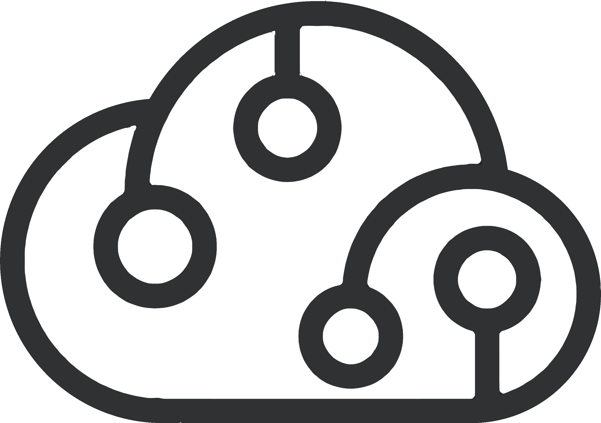

<p align="center">
  <br />
  
  <br />
  <br />
</p>

<h1 align='center'>cdwr</h1>

<p align='center'>
  The Codeware Sthlm platform monorepo — a multi-tenant Payload CMS in production,
  and the Nx tooling that builds and ships it.
  <br />
  <br />
  <a href='https://www.npmjs.com/package/@cdwr/nx-payload'></a>
  &nbsp;
  <a href='https://opensource.org/licenses/MIT'></a>
  <br />
  <br />
</p>

Three things live here, at different levels of maturity:

- **The platform** — a multi-tenant CMS built on [Payload](https://payloadcms.com) v3 and
  Next.js, serving tenant sites and their admin from one app. Custom domains with automated
  certificate issuance, per-tenant content scoping, forms, bookings and a themed admin.
- **[`@cdwr/nx-payload`](packages/nx-payload) and
  [`create-nx-payload`](packages/create-nx-payload)** — published Nx plugins that add Payload
  support to any Nx workspace. Developed here, against the platform that actually uses them.
- **The delivery pipeline** — release-driven deploys to [Fly.io](https://fly.io), where an app ships
  when its conventional commits produce a version bump. Per-pull-request preview environments, and
  the internal GitHub Actions that drive them.

## Contents <!-- omit in toc -->

- [Packages](#packages)
  - [Nx Plugins](#nx-plugins)
  - [GitHub Actions](#github-actions)
  - [Node Libraries](#node-libraries)
- [Development](#development)
- [Releases](#releases)
- [Deployment](#deployment)

## Packages

### Nx Plugins

#### [`nx-payload`](packages/nx-payload) <!-- omit in toc -->

Add support for [Payload](https://payloadcms.com) in your existing [Nx](https://nx.dev) workspace.

```sh
npx add @cdwr/nx-payload
```

##### [`create-nx-payload`](packages/create-nx-payload) <!-- omit in toc -->

Quickly create a new [Nx](https://nx.dev) workspace with a [Payload](https://payloadcms.com) application, using the plugin as a preset.

```sh
npx create-nx-payload
```

### GitHub Actions

A set of **internal** actions drives this repository's own delivery pipeline — gating,
image build, deploy, preview teardown, PR status and automatic Nx migrations. They are
consumed locally via `uses: ./packages/<name>` and are not published to npm or the GitHub
Marketplace; a GitHub Action is not installable from npm.

### Node Libraries

#### [`fly-node`](packages/fly-node) <!-- omit in toc -->

Fly CLI node wrapper for programmatic deployments to [Fly.io](https://fly.io).

## Development

Local setup, the CMS host/tenant modes, database and seed commands, dev email and the admin
import-map rule are documented in [CLAUDE.md](CLAUDE.md), which is kept current as the
workspace changes. It is the single source for how to run things here — this file deliberately
does not repeat it.

Interactive CLIs for managing deployments and workspace configuration:

```sh
pnpm cdwr
```

## Releases

Releases are cut from a developer's machine; GitHub Actions publishes to npm on the resulting
tags.

```sh
nx release-cli
```

## Deployment

Applications deploy to [Fly.io](https://fly.io) from GitHub Actions, for both single-tenant and
multi-tenant setups. The pipeline detects affected applications with Nx, resolves the target
environment, and deploys production on merge or an isolated preview environment per pull
request.
