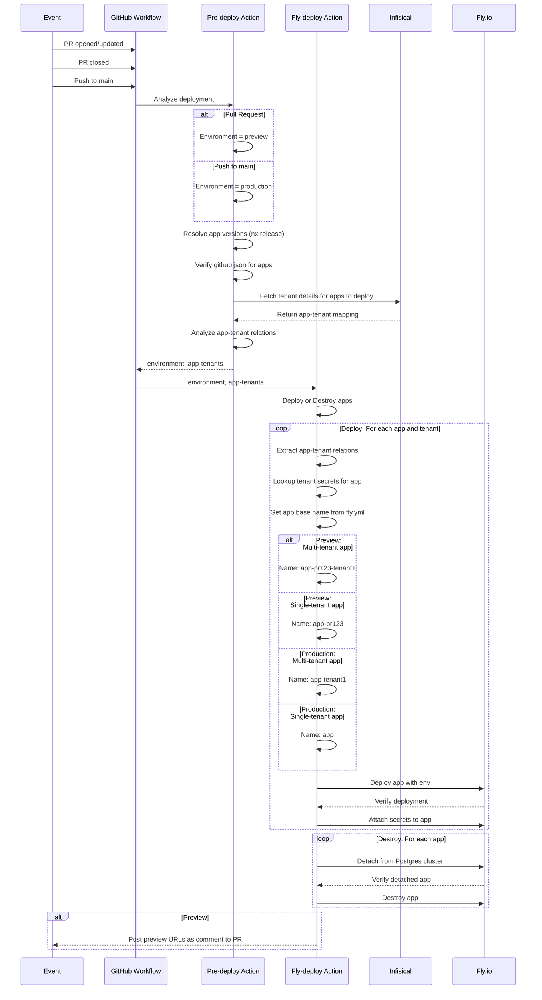

# Deployment Guide <!-- omit in toc -->

This document explains the deployment architecture and configuration for the Codeware monorepo, which uses GitHub Actions to automatically deploy applications to Fly.io with support for multi-tenant deployments.

## Table of Contents <!-- omit in toc -->

- [Overview](#overview)
- [Manual Redeployment](#manual-redeployment)
- [Architecture](#architecture)
- [Configuration](#configuration)
  - [Per-App Configuration (github.json)](#per-app-configuration-githubjson)
  - [Fly Configuration Files](#fly-configuration-files)
  - [Tenant Configuration (Infisical)](#tenant-configuration-infisical)
  - [Secret Loading: Deployment vs Runtime](#secret-loading-deployment-vs-runtime)
  - [Non-Secret Platform Configuration](#non-secret-platform-configuration)
  - [Signature Secret Rollover](#signature-secret-rollover)
  - [Tenant API Key Rotation](#tenant-api-key-rotation)
  - [Sentry](#sentry)
  - [Deployment Rules (Required)](#deployment-rules-required)
  - [GitHub Secrets](#github-secrets)
- [Versioning](#versioning)
  - [What Triggers a Deployment](#what-triggers-a-deployment)
  - [Preview Lanes](#preview-lanes)
  - [Tags Are Written After a Successful Deploy](#tags-are-written-after-a-successful-deploy)
  - [Changelogs](#changelogs)
  - [Why Not `nx affected`](#why-not-nx-affected)
- [Deployment Flow](#deployment-flow)
  - [Multi-Tenant Deployment](#multi-tenant-deployment)
  - [Single-Tenant Apps](#single-tenant-apps)
- [How to Add a New App](#how-to-add-a-new-app)
- [How to Add/Remove Tenants](#how-to-addremove-tenants)
  - [Add a New Tenant](#add-a-new-tenant)
  - [Remove a Tenant](#remove-a-tenant)

## Overview

The deployment system automatically:

- Determines deployment environment (preview for PRs, production for main)
- Analyzes which Nx apps have a new release to ship (see [Versioning](#versioning))
- Fetches tenant configuration from Infisical for multi-tenant apps
- Deploys each app to Fly.io (once per tenant for multi-tenant apps)
- Posts preview URLs as PR comments

## Manual Redeployment

Sometimes deployments fail or you need to redeploy without pushing new code. The workflow supports manual triggers via GitHub Actions UI.

### How to Trigger Manual Deployment <!-- omit in toc -->

1. Navigate to **Actions** → **Fly Deployment** in GitHub
2. Click **Run workflow** button
3. Configure deployment options:
   - **App**: Select specific app (`cms`, `web`) or leave empty for all apps with a new release
   - **Tenant**: Enter tenant ID (e.g., `demo`) or leave empty for all tenants
   - **Environment**: Choose `preview` or `production` (required)
   - **Console logs**: Enable to see aggregated application logs during deployment (useful for debugging Fly commands)
4. Click **Run workflow**

### Use Cases <!-- omit in toc -->

**Redeploy everything to production:**

- App: `<empty>`
- Tenant: `<empty>`
- Environment: `production`

**Redeploy specific app for all tenants:**

- App: `web`
- Tenant: `<empty>`
- Environment: `production`

**Redeploy specific tenant:**

- App: `web`
- Tenant: `acme`
- Environment: `production`

**Redeploy CMS only:**

- App: `cms`
- Tenant: `<empty>`
- Environment: `production`

**Debug deployment CLI issues:**

- App: `web`
- Tenant: `demo`
- Environment: `preview`
- Console logs: `enabled`

> [!NOTE]
> Manual deployments bypass the release analysis and deploy the specified app(s) regardless of whether anything bumped them, at their last released version. The tenant input only applies to multi-tenant apps like `web`.

## Architecture

### Components <!-- omit in toc -->

```text
┌──────────────────────────────────────┐
│ GitHub Actions Workflow              │
│                                      │
│ .github/workflows/fly-deployment.yml │
└──────────────────────────────────────┘
    │
    ├─► Job 1: analyze-conditions
    │    ├─ Analyze required deploy conditions
    │    │   ├─ Skip Renovate workflows
    │    │   ├─ Skip Nx Migrate workflows
    │    │   └─ Skip Pull Request updates unless the preview label exists
    │    ├─ Detect a Pull Request is opened or reopened
    │    │   └─ Add label 'preview-deploy'
    │    └─ Output: skip
    │
    ├─► Job 2: pre-deploy
    │    ├─ Abort deployment process when skip output from job 1 is 'true'
    │    ├─ Determine environment (preview/production)
    │    ├─ Resolve app versions and select what to release
    │    ├─ Fetch secrets and app-tenant relationships
    │    │   from Infisical
    │    └─ Output: apps, environment, app-tenants
    │
    └─► Job 3: fly-deployment
         ├─ For each app to deploy:
         │   ├─ If multi-tenant: deploy once per tenant
         │   └─ If single-tenant: deploy once
         └─ Post preview comment (for PRs)
```

### Key Packages <!-- omit in toc -->

1. **[@cdwr/nx-pre-deploy-action](../packages/nx-pre-deploy-action/README.md)** - Analyzes deployment requirements
   - Determines target environment based on GitHub event
   - Identifies Nx applications with a new release to ship
   - Validates `github.json` for each application
   - Fetches app-specific tenant configuration and secrets from Infisical
2. **[@cdwr/nx-fly-deployment-action](../packages/nx-fly-deployment-action/README.md)** - Executes deployments
   - Manages Fly.io application lifecycle
   - Handles multi-tenant deployments
   - Manages preview/production environments

> [!NOTE]
> See individual package READMEs for detailed API documentation, configuration options, and usage examples.

## Configuration

### Per-App Configuration (github.json)

Each deployable app needs a `github.json` file in its root directory (same location as `fly.toml`):

```json
{
  "$schema": "../../libs/shared/util/schemas/src/lib/github-config.schema.json",
  "flyPostgresPreview": "${POSTGRES_PREVIEW}",
  "flyPostgresProduction": "my-production-db",
  "flyPostgresDatabaseName": "shared_database"
}
```

**Fields:**

- `flyPostgresPreview` (string, optional) - Fly Postgres cluster name for preview env
- `flyPostgresProduction` (string, optional) - Fly Postgres cluster name for production env
- `flyPostgresDatabaseName` (string, optional) - Shared database name for all apps (ensures multiple apps use the same database instead of creating separate ones)

**Deployment Detection:**

Apps are automatically detected for deployment if they have:

1. A `github.json` file in the app root
2. A Fly configuration file (see [Fly Configuration Files](#fly-configuration-files))

**Examples:**

Multi-tenant app (web):

```json
{}
```

Empty `github.json` is valid - the app will be deployed if it has a `fly.toml` file.

Single-tenant app (cms):

Using a Fly Postgres cluster for preview (pull request) apps. Production database is not hosted by Fly.

```json
{
  "flyPostgresPreview": "${POSTGRES_PREVIEW}",
  "flyPostgresDatabaseName": "cdwr_cms_shared"
}
```

**Note:** `flyPostgresDatabaseName` ensures that both the platform CMS host and all tenant deployments share the same database. Without this, each app would get its own empty database, causing "relation does not exist" errors in tenant apps.

### Fly Configuration Files

Apps need a Fly configuration file to be deployed. The system looks for config files in this priority order:

1. **Environment-specific config**: `fly.{environment}.toml` (e.g., `fly.production.toml`, `fly.preview.toml`)
2. **Default config**: `fly.toml`

This allows you to have different Fly configurations per environment while falling back to a shared config when environment-specific files don't exist.

> [!IMPORTANT]
> Fly configuration files are only used for deployment of **new apps**. For existing apps the remote configurations are preserved.
>
> This is to prevent overriding any individual ad-hoc configurations applied to the apps.

**Example: Different machine sizes per environment**

```toml
# fly.preview.toml - Smaller machines for preview
app = "my-app"

[[vm]]
  size = 'shared-cpu-1x'
  memory = '512mb'
```

```toml
# fly.production.toml - Larger machines for production
app = "my-app"

[[vm]]
  size = 'shared-cpu-2x'
  memory = '2gb'
```

### Tenant Configuration (Infisical)

Infisical is the single source of truth for both secrets and tenant configuration.

**Key Concepts:**

- App-level secrets: `/apps/<app-name>/*`
- Tenant-app secrets: `/tenants/<tenant-id>/apps/<app-name>/*`
- Third-party credentials: `/integrations/<provider>/*`
- Tenant discovery: System scans `/tenants/` folder structure to determine which tenants use which apps
- Dynamic CORS: CMS automatically fetches tenant app URLs tagged with `cors` at boot for CORS configuration

> [!NOTE] Detailed multi-tenant setup
>
> - Complete folder structure guide
> - Secret classification (env vars vs encrypted secrets)
> - Step-by-step configuration examples
> - Deploy rules configuration
>
> **See:** [Multi-tenant Setup Guide](../packages/nx-pre-deploy-action/README.md#multi-tenant-setup)

**Quick Example:**

```yml
# App-wide configuration
/apps/web/API_URL = "https://api.example.com"

# Per-tenant configuration
/tenants/demo/apps/web/PUBLIC_URL = "https://demo.example.com"
/tenants/acme/apps/web/PUBLIC_URL = "https://acme.example.com"

# Hybrid deployment (both cms host + tenant-scoped)
/tenants/_default/apps/cms/  # CMS host (no TENANT_ID)
/tenants/demo/apps/cms/      # Tenant-scoped CMS (TENANT_ID=demo)
```

> [!TIP]  
> Use the reserved tenant name `_default` to be able to deploy an app both as a cms host instance (without `TENANT_ID`) and as tenant-scoped instances. The `_default` tenant follows DEPLOY_RULES like any other tenant.

### Secret Loading: Deployment vs Runtime

Secrets are loaded at two distinct stages, each serving different purposes:

**Deployment-Time Secrets** (loaded during GitHub Actions)

- **Location**: `/tenants/<tenant-id>/apps/<app-name>/` (recursive)
- **Purpose**: Configuration that determines how apps are deployed
- **Fetched by**: Pre-deploy action during CI/CD workflow
- **Examples**: `PAYLOAD_API_KEY`, tenant-specific build configuration
- **Characteristics**:
  - Baked into Fly.io app configuration as env vars or secrets
  - Static after deployment (requires redeployment to change)
  - Uses metadata `env: true` to distinguish env vars from secrets (default)
- **Use when**: Configuration defines tenant-specific deployment details

**Runtime Secrets** (loaded when app starts)

- **Location**:
  - `/apps/<app-name>/` (recursive)
  - `/tenants/<tenant-id>/` (shallow - to avoid loading tenants apps secrets)
- **Purpose**: Sensitive data and operational secrets
- **Fetched by**: Application itself at startup using `withInfisical()` SDK
- **Examples**: Database credentials, API keys, encryption keys, feature flags
- **Characteristics**:
  - Loaded fresh on each app startup
  - Can be rotated without redeployment (app restart required)
  - Requires Infisical credentials set as Fly.io secrets
- **Use when**: Secrets need frequent rotation or shouldn't be bundled in the deployment

**On-Demand Integration Credentials** (read when an operation needs them)

- **Location**: `/integrations/<provider>/`
- **Purpose**: Credentials for a third-party provider the platform acts through
- **Fetched by**: Application when the feature runs, using `getIntegrationCredentials()`
- **Examples**: `/integrations/fly/API_TOKEN` — an org-scoped Fly token used to
  request and check TLS certificates for tenant custom domains
- **Characteristics**:
  - Never injected into `process.env`, so the token cannot leak through a child
    process, a crash dump or an env listing
  - Cached in memory for five minutes; a rotated token is picked up on expiry
  - A missing folder disables the feature it powers rather than failing boot
- **Use when**: The credential is platform-wide, powerful, and only needed by one
  feature — not on every request

**Key Limitation**: Deployment-time secrets are static until next deployment. Runtime secrets add startup latency but enable rotation without redeployment.

**Public or hidden secret:**

Secrets can be resolved to either an environment variable or a hidden secret in Fly. Environment variables are visible and added to the Docker image at build-time and secrets are loaded at boot-time, fully encrypted.

Secrets in Infisical are handled as **secrets by default**.

To make a secret visible as **environment variable**, add metadata key `env` set to `true`.

### Non-Secret Platform Configuration

Not everything the CMS needs to know belongs in Infisical. The boundary:

- **Secrets** — `PAYLOAD_SECRET_KEY`, S3 and SendGrid credentials, the Fly token, Sentry
  DSN. A database is the wrong home: they end up in backups, in the admin UI, and in
  whatever a system user can read.
- **Config needed to reach or identify the deployment** — `DATABASE_URL`, `TENANT_ID`,
  `DEPLOY_ENV`. Config the app needs before it has a database cannot live in the database.
- **Everything else platform-wide** — non-secret, needed only after the database is up,
  and genuinely worth editing with a form — lives in the CMS's `platform-settings`
  collection instead, where it gets field validation and version history. The host cms's
  own custom domain is the first example: it lives in `platform-settings.domains`, the
  same shape as a tenant's `domains` field, with certificate state managed from the same
  admin panel.

Config that decides which url a deployment serves is boot-read from the database
(`onInit`), never baked into the build, since the database is what the config is being
built to reach. `DISABLE_DOMAIN_ADOPTION` is the break-glass escape hatch: set it and the
app stops taking a database-stored domain as its own identity, falling back to its plain
Fly url instead — so a bad row can never be what keeps a deployment unreachable at the
address it generates links for. It does not stop the api answering that domain: cors and
csrf still extend to include it, since an issued certificate means the origin really is
being served, whatever the identity override says. It replaces carrying an override
hostname in an env var — the fallback address is already known (`FLY_URL`), so the lever
only needs to be a boolean.

`CUSTOM_URL` (the old override this pattern replaces — tenant `domains`, or
`platform-settings.domains` for the host cms) is no longer read anywhere in the
codebase. Any lingering `CUSTOM_URL` value in Infisical is now dead configuration
and should be removed.

Not every non-secret value has moved, or should. `MAINTENANCE_MODE` stays in env
deliberately: it is read in `apps/cms/src/proxy.ts` middleware and has to keep working
when the database is unreachable — including when the database is why the app is in
maintenance mode in the first place. Config for outages must not depend on the thing that
is out.

### Signature Secret Rollover

`SIGNATURE_SECRET` is shared: every `web` deployment signs its requests with it and cms host
verifies them. Replacing it in one place breaks every signed request, so cms host accepts an
optional `SIGNATURE_SECRET_PREVIOUS` to keep both valid while clients roll over.

The secret lives in `/apps/cms/signature/`, which `web` picks up through an Infisical folder
import — that is why a single value is shared by every deployment. cms loads `/apps/cms`
recursively, so the rollover key goes in that same folder.

Drive the rollover through the CLI rather than editing Infisical by hand:

```sh
pnpm cdwr   # → rotate-signature-secret
```

The two secrets _are_ the progress marker — there is nothing else to track — so the command
reads them, works out where the rollover stands and carries it through in one run:

| Step | Action                                                   | Then            |
| ---- | -------------------------------------------------------- | --------------- |
| 1    | Copy the active secret to `SIGNATURE_SECRET_PREVIOUS`    | Restart cms     |
| 2    | Generate a new `SIGNATURE_SECRET` (cms now accepts both) | Restart cms→web |
| 3    | Remove `SIGNATURE_SECRET_PREVIOUS`                       | Restart cms     |

Unlike `PAYLOAD_API_KEY`, this secret is a **runtime** one: cms loads `/apps/cms` recursively
when it boots and web loads `/apps/web`, so neither holds it as a Fly secret. Restarting is
therefore enough — no redeploy, and nothing to write to Fly.

Ordering is what keeps it seamless. cms learns each new value before web starts using it, and
accepts both throughout, so no request is ever rejected mid-rollover. Step 3 is the only
destructive one, and by then every signer is already on the new secret.

If a run is interrupted the progress lives in the secrets themselves, so running the command
again resumes from wherever it stopped. An interruption leaves cms accepting _more_ secrets
rather than fewer, which is the safe direction.

Tenant-scoped cms deployments are skipped: they run in tenant mode, where the signature secret
is not part of `APP_MODE` and nothing verifies with it.

### Tenant API Key Rotation

`PAYLOAD_API_KEY` is stored twice: on the Payload tenant document (the source of truth) and
in Infisical under every `/tenants/<id>/apps/<app>` that deploys it. Both have to move
together, so rotate through the CLI rather than by hand:

```sh
pnpm cdwr   # → rotate-tenant-key
```

It generates a new key, writes the tenant document via the local-api, mirrors it to each
Infisical app folder, then prints the redeploy command. The `apiKey` field is
`update: () => false` for REST, GraphQL and the admin UI, which is why this runs as a
script and not from the admin panel.

> [!IMPORTANT]
> An Infisical tenant id is **not** a Payload tenant slug. `/tenants/demo` is a deployment
> name; the tenant it configures may be slugged something else entirely. The link between
> them is the API key — which is exactly what a deployment authenticates with, see
> `resolveScopedTenant`.
>
> So the tool resolves the tenant by the key currently in Infisical, shows you which Payload
> tenant that turned out to be, and only rotates after you confirm that mapping. If no tenant
> matches, the two have drifted apart or the wrong environment was selected — rotating on a
> guess would hand a new key to the wrong tenant.

Reaching the database differs per environment, which the tool handles:

- **Production** runs on Supabase, so `DATABASE_URL` is an Infisical secret. It is rewritten
  to the Session Mode pooler host, which is routable from a laptop.
- **Preview** databases are created by `fly postgres attach` at deploy time, so the URL only
  exists as a Fly secret on that pull request's cms app — not in Infisical, and
  `fly secrets list` returns digests rather than values. The tool asks which cms app to use,
  starts a machine if they are all suspended, reads the URL from inside it over SSH, then
  opens a `fly proxy` tunnel because the host is a private `.flycast` address.

> [!IMPORTANT]
> **A redeploy does not propagate a rotated key.** The deployment only sets secrets that are
> missing from an app and logs `Secret 'X' already exists, skipping` for the rest, so a
> changed `PAYLOAD_API_KEY` never reaches an already-deployed app that way.
>
> The tool therefore writes to the Fly apps itself. It stages the secret on every app the
> tenant deploys, and only once they are all staged does it apply them — so cms and web take
> the new key together instead of each restarting as its own secret lands.

There is no zero-downtime path — Payload stores one key per tenant. The tenant's deployments
keep using the retired key until their machines restart, so that tenant serves errors in
between. Rotate one tenant at a time.

### Sentry

**The model: projects are apps, releases are builds, tenants are a tag.**

- **One Sentry project per app** — `cms` and `web`. Projects never reflect tenants.
- **One release per build per app** — `name@version+sha`, e.g. `cms@1.4.0+ab12cd3`. All
  tenants run the same image, so they share the release. Never per-tenant releases.
- **Tenants are separated by a `tenant` tag** set at runtime, filtered within the one
  project and release.

**Configuration:**

The project slug and DSN live in the app's own Infisical folder, so each app resolves its
own. Organization and auth token are shared and come from the root path via GitHub secrets.

| Location      | Secret              | Used by                                                  |
| ------------- | ------------------- | -------------------------------------------------------- |
| `/` (root)    | `SENTRY_ORG`        | workflow, as `INF_SENTRY_ORG`                            |
| `/` (root)    | `SENTRY_AUTH_TOKEN` | workflow + source map upload, as `INF_SENTRY_AUTH_TOKEN` |
| `/apps/<app>` | `SENTRY_PROJECT`    | that app only                                            |
| `/apps/<app>` | `SENTRY_DSN`        | that app only                                            |

An app missing either `/apps/<app>` key simply runs without Sentry — the deployment is not
affected.

**How it works:**

1. **Resolution** (`nx-pre-deploy-action`): reads `/apps/<app>/SENTRY_{PROJECT,DSN}` from
   Infisical and attaches them to each app as `sentry: { project, dsn }`
2. **Release naming** (GitHub workflow): after `Stamp app versions` writes the resolved
   version into each manifest (see [Versioning](#versioning)), the release name
   `name@version+sha` is resolved per app and merged into `sentry.release`
3. **Release creation** (GitHub workflow): one release per app, created in that app's own
   project before the build so source maps have something to attach to
4. **Commit association**: each release is linked to commits (best-effort)
5. **Source map upload** (Docker build): `@sentry/nextjs` for cms, `@sentry/vite-plugin`
   for web, each uploading to its own project and release
6. **Release finalization** (GitHub workflow): after all deployments succeed, every release
   is finalized. On failure they are deleted again.

The build and deploy actions are pass-through: they turn each app's `sentry` details into
per-app `SENTRY_DSN`, `SENTRY_PROJECT` and `SENTRY_RELEASE` build args and runtime env, on
top of the shared values the workflow passes.

**Tenant tagging:**

| Deployment              | Tag source                                                          |
| ----------------------- | ------------------------------------------------------------------- |
| web (always one tenant) | `TENANT_ID` at boot, server and client                              |
| cms tenant mode         | `TENANT_ID` at boot, plus `mode: tenant`                            |
| cms host mode           | per request from the authenticated tenant's slug, plus `mode: host` |

A host deployment serves every tenant from one process, so a boot-time tenant tag would be
wrong there — it tags the isolation scope of each request instead.

**Docker Build Requirements:**

For source maps to upload during Docker builds, the Sentry environment variables must be:

1. Passed as build arguments (`--build-arg`) to the `docker build` command
2. Converted to environment variables (`ENV`) in the Dockerfile **before** the build command

Example in Dockerfile:

```dockerfile
ARG SENTRY_AUTH_TOKEN
ARG SENTRY_DSN
ARG SENTRY_ORG
ARG SENTRY_PROJECT
ARG SENTRY_RELEASE

# Convert to ENV so the bundler plugin can access them during build.
# The client-side prefix differs per framework (NEXT_PUBLIC_ / VITE_).
ENV SENTRY_AUTH_TOKEN=$SENTRY_AUTH_TOKEN \
    SENTRY_ORG=$SENTRY_ORG \
    SENTRY_PROJECT=$SENTRY_PROJECT \
    SENTRY_RELEASE=$SENTRY_RELEASE \
    NEXT_PUBLIC_SENTRY_DSN=$SENTRY_DSN \
    NEXT_PUBLIC_SENTRY_RELEASE=$SENTRY_RELEASE

RUN npx nx build cms  # Source maps uploaded here
```

> [!IMPORTANT]
> With multi-stage builds, these ENV variables exist only in the builder stage and are **not** included in the final deployed image.

### Deployment Rules (Required)

Control which apps and tenants are deployed per environment using a `DEPLOY_RULES` secret in the Infisical root path (`/`). **This secret is required** - deployments will fail if it's missing or misconfigured.

**Quick Setup:**

Create a `DEPLOY_RULES` secret with metadata or JSON value per environment:

```yml
Path: /
Secret: DEPLOY_RULES
Metadata per environment:
  preview:
    apps: '*'
    tenants: 'demo' # Only demo tenant in preview
  production:
    apps: '*'
    tenants: '*' # All tenants in production
```

**Rules format:** `apps: "*"` (all apps) or `apps: "web,cms"` (specific apps) | `tenants: "*"` (all) or `tenants: "demo,acme"` (specific)

> [!NOTE] Complete deployment rules documentation
>
> - Both configuration options (metadata vs JSON value)
> - Full rules format reference
> - Validation requirements
> - Advanced use cases
>
> **See:** [Deploy Rules Documentation](../packages/nx-pre-deploy-action/README.md#3-deploy-rules)

### GitHub Secrets

Required secrets in GitHub repository settings:

```yml
INFISICAL_READ_CLIENT_ID       # Infisical auth client ID
INFISICAL_READ_CLIENT_SECRET   # Infisical auth client secret
INFISICAL_PROJECT_ID           # Infisical project ID
FLY_API_TOKEN                  # Fly.io API token
CDWR_ACTIONS_BOT_ID            # GitHub App ID for bot
CDWR_ACTIONS_BOT_PRIVATE_KEY   # GitHub App private key
```

Required variables:

```yml
INFISICAL_SITE                 # Infisical site region
FLY_ORG                        # Fly.io organization
FLY_REGION                     # Fly.io default region
FLY_OPT_OUT_DEPOT              # Opt out of depot builder
FLY_POSTGRES_PREVIEW           # Preview postgres cluster
```

## Versioning

Apps are versioned by `nx release`, in the `apps` release group (`nx.json` → `release.groups`).
Versions are never committed — the branch stays untouched and the release **tag** is the source
of truth. Each app's version is stamped into its manifest during the build so the image, the
About UI, `/api/version` and the Sentry release name all agree.

### What Triggers a Deployment

**A deployment is a release.** An app deploys when its conventional commits produce a version
bump since its last release tag — nothing else.

`nx release` resolves this per project, using the same affected detection as `nx affected` but
with the project's last release tag as the baseline. Consequences worth knowing:

- **There is one project graph.** A change to a lib reaches every app depending on it, even
  though app manifests declare no `@codeware/*` dependencies (they are consumed via tsconfig
  path aliases). A shared-lib change therefore releases both apps.
- **An indirect change still yields a patch bump.** Reaching a project only through the graph
  is enough.
- **`test:` and `ci:` commits produce nothing.** They are configured `semverBump: none`, so a
  PR containing only those deploys nothing. This is deliberate — but it means the commit type
  has to honestly reflect whether the change ships. A `test:` commit that also edits a
  `Dockerfile` or `fly.*.toml` will **not** deploy.
- **Workspace-root config bumps everything.** `nx.json`, `eslint.config.mjs`, `tsconfig.base.json`
  and the lockfile are global inputs to the project graph, so editing one marks every app as
  changed and redeploys them all. Expected, but worth knowing before a one-line config tweak
  ships both apps.
- **Manual dispatch bypasses all of this.** Selecting an app deploys it regardless of bump, at
  its last released version.

### Preview Lanes

Preview deployments version within a per-PR lane, `--preid preview.<pr-number>`, producing tags
like `cms-1.3.2-preview.466.2`. Concurrent PRs therefore never race for the same counter.
Production releases carry no prerelease id.

### Tags Are Written After a Successful Deploy

The release tag is pushed in the `deploy` job, only for apps that actually deployed — never
before the build. This ordering is what makes the pipeline self-healing:

| Outcome         | Tag pushed? | Next run                                      |
| --------------- | ----------- | --------------------------------------------- |
| Deploy succeeds | yes         | baseline advances, no new commits → no deploy |
| Deploy fails    | no          | baseline unchanged → same bump → redeploys    |

A failed or cancelled run therefore cannot leave a preview silently stale, and a successful one
is never redeployed for nothing.

### Changelogs

Production creates a **GitHub release** per app. Previews post the same contents as a collapsed
section on the deploy comment instead — a release per preview push would bury the real ones.
No `CHANGELOG.md` is written either way: apps have no consumers to read one, and committing it
would fight the release process leaving the branch untouched.

Each deploy posts a **new** comment rather than updating the previous one. A changelog covers
only the range since the last preview deploy, so replacing the comment would discard the record
of what earlier pushes shipped — and move the reader's scroll position. The extra comments are
the cheaper trade.

Selection follows the project graph, but a changelog only lists commits that touched the app's
own files. A shared-lib or workspace-config change therefore deploys an app with an empty
changelog — those are omitted rather than rendered as "no changes".

### Why Not `nx affected`

Deployment selection used to be `nx affected` against `origin/main`, which asks a wider
question: _what must be rebuilt and retested?_ That is the right question for lint, test and
build, but not for shipping — it redeploys apps whose consumer-visible behaviour did not
change.

It also forced a workaround. Because affected deployed apps that `nx release` never versioned,
their manifests still held the placeholder version from git, and a `Backfill unbumped app
versions` step had to recover the real version from the tags. Making the bump the deploy
trigger removed the mismatch, and the backfill with it.

The self-healing property that previously justified affected is preserved by the tag ordering
above, rather than by re-deploying the whole PR diff every time.

## Deployment Flow



### Multi-Tenant Deployment

#### How It Works <!-- omit in toc -->

1. **Tenant-App Relations**: Pre-deploy action fetches tenant configuration from Infisical
2. **Per-Tenant Deployment**: Each tenant gets its own isolated Fly.io app instance
3. **Naming Convention**: The base app name from `fly.toml` (`app = "base-name"`) is used with suffixes:
   - Production: `<base-name>-<tenant-id>`
   - Preview: `<base-name>-pr<number>-<tenant-id>`
4. **Environment Variables**: Each instance receives `TENANT_ID`, `DEPLOY_ENV`, `APP_NAME`, and `PR_NUMBER`

> [!NOTE]
>
> - Detailed deployment mechanics
> - Naming conventions
> - app-details structure
>
> **See:** [Nx Fly Deployment Action - app-details input](../packages/nx-fly-deployment-action/README.md#app-details)

#### Benefits <!-- omit in toc -->

✅ **Complete Isolation**: Each tenant has its own app instance
✅ **Independent Scaling**: Scale tenants independently
✅ **Tenant-Specific Configuration**: Each tenant can have its own secrets/config
✅ **Easy Rollback**: Roll back one tenant without affecting others
✅ **Clear Monitoring**: Per-tenant metrics and logs

### Single-Tenant Apps

- Deploy once per environment
- No tenant suffix in app name
- Traditional deployment model
- Example: `cms` app serves all tenants from single instance

## How to Add a New App

1. **Create github.json** in the app root:

   ```json
   {}
   ```

   Or with Postgres configuration:

   ```json
   {
     "flyPostgresPreview": "${POSTGRES_PREVIEW}",
     "flyPostgresProduction": "my-production-db"
   }
   ```

2. **Create fly.toml** in the app root:

   ```toml
   app = "my-new-app"
   primary_region = "arn"

   [build]
     dockerfile = "Dockerfile"

   [http_service]
     internal_port = 3000
     force_https = true
     auto_stop_machines = 'suspend'
     auto_start_machines = true
     min_machines_running = 0
     processes = ['app']

   [[vm]]
     size = 'shared-cpu-1x'
     memory = '1gb'
   ```

   Optionally create environment-specific configs:
   - `fly.preview.toml` - For preview deployments
   - `fly.production.toml` - For production deployments

3. **Configure Infisical**:
   - Create a folder and secrets at `/apps/my-new-app/*`
   - For multi-tenant apps: Create folders for related tenants `/tenants/<id>/apps/my-new-app/`

4. **Push changes** - deployment happens automatically!

## How to Add/Remove Tenants

### Add a New Tenant

1. **Create folder structure** in Infisical for each app the tenant will use:

   ```yml
   /tenants/<new-tenant-id>/apps/<app>
   ```

2. **Add tenant-specific secrets** when needed:

   ```yml
   /tenants/<new-tenant-id>/apps/web/API_KEY = "..."
   /tenants/<new-tenant-id>/apps/web/CUSTOM_CONFIG = "..."
   ```

3. **Deploy** - next deployment will automatically detect and deploy the new tenant!

### Remove a Tenant

1. **Delete folder** in Infisical:
   - Remove `/tenants/<tenant-id>/` folder entirely

2. **Clean up Fly.io apps** (manual):

   ```bash
   fly apps destroy web-<tenant-id> --yes
   fly apps destroy web-pr123-<tenant-id> --yes  # if preview exists
   ```

3. **Next deployment** will no longer include this tenant
