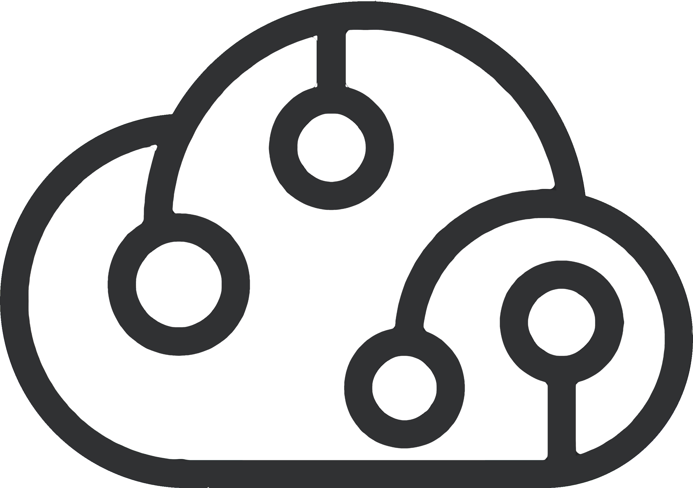

<p align="center">
  <br />
  
  <br />
  <br />
</p>

<h1 align='center'>PR Comment Action</h1>

<p align='center'>
  GitHub action that posts a deployment status comment to a pull request.
  <br />
  <br />
  <a href='https://www.npmjs.com/package/@cdwr/pr-comment-action'></a>
  &nbsp;
  <a href='https://opensource.org/licenses/MIT'></a>
  <br />
  <br />
</p>

## Description

Posts a deployment status summary as a comment on the pull request. Updates the comment on each run so the PR always shows the latest deployment state. The comment includes deployed URLs and any failures.

## Usage

This action is typically the last step after [fly-deployment-action](https://github.com/codeware-sthlm/codeware/tree/main/packages/fly-deployment-action#readme). It uses the `deployed` and `failed` outputs from the deployment step.

```yaml
pr-comment:
  needs: [pre-deploy, deploy]
  if: always() && github.event_name == 'pull_request' && github.event.action != 'closed'
  runs-on: ubuntu-latest

  steps:
    - uses: actions/checkout@v4

    # Install dependencies, build the action...

    - name: Post PR comment
      uses: ./packages/pr-comment-action
      with:
        pull-request: ${{ github.event.number }}
        environment: ${{ needs.deploy.outputs.environment }}
        deployed: ${{ needs.deploy.outputs.deployed }}
        failed: ${{ needs.deploy.outputs.failed }}
        token: ${{ secrets.GITHUB_TOKEN }}
```

## Inputs

See [action.yml](action.yml) for descriptions of all inputs.
